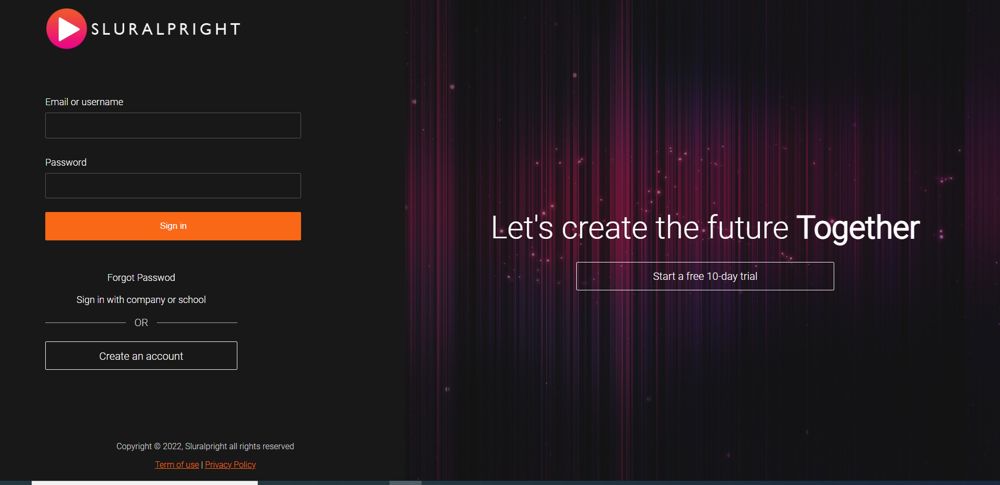
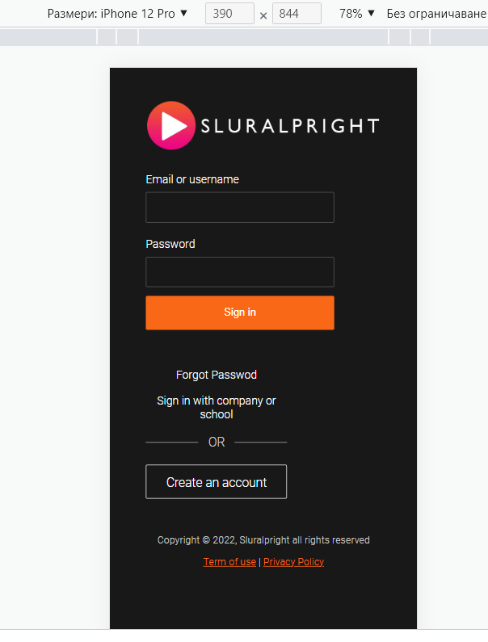

# See my login page example.
https://idinovski.github.io/login-page/

# About the project
A login page which provides details of the application to the end user.
The website is completely responsive

# Used tools
The website is made with HTML5 and CSS.

# Screenshots

